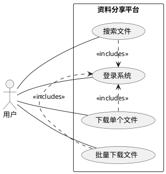
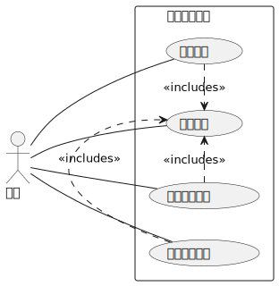
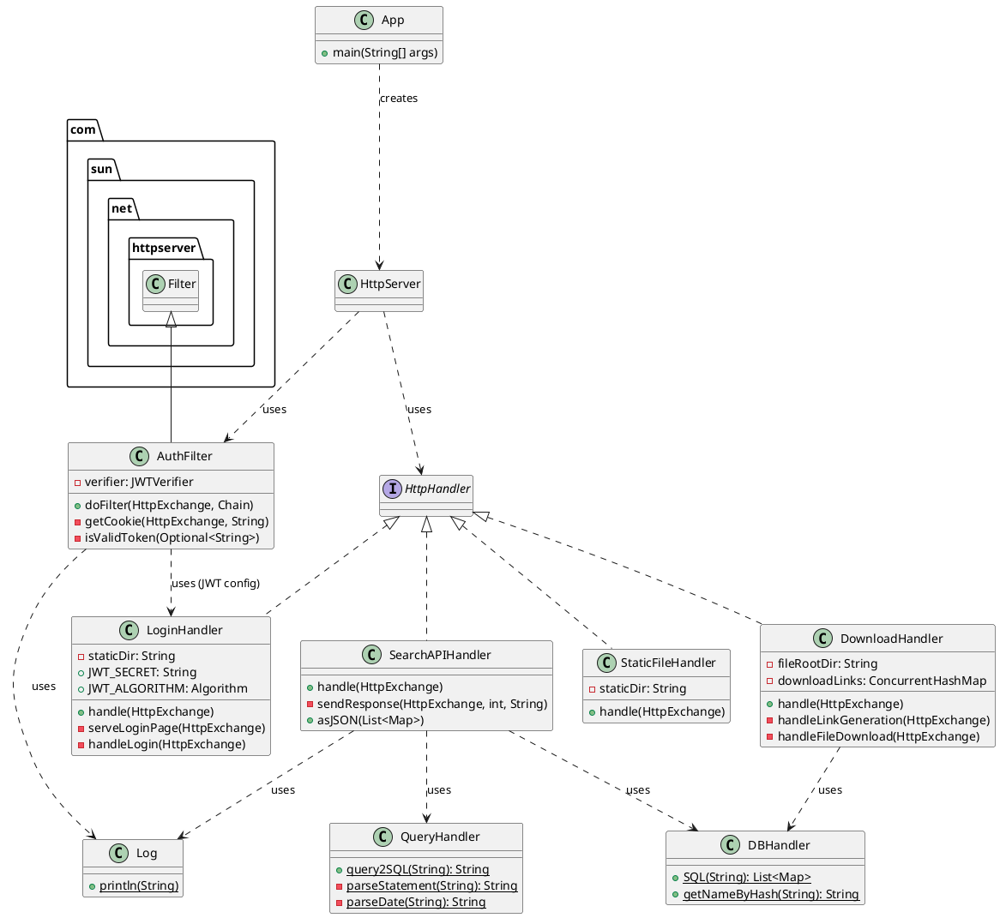
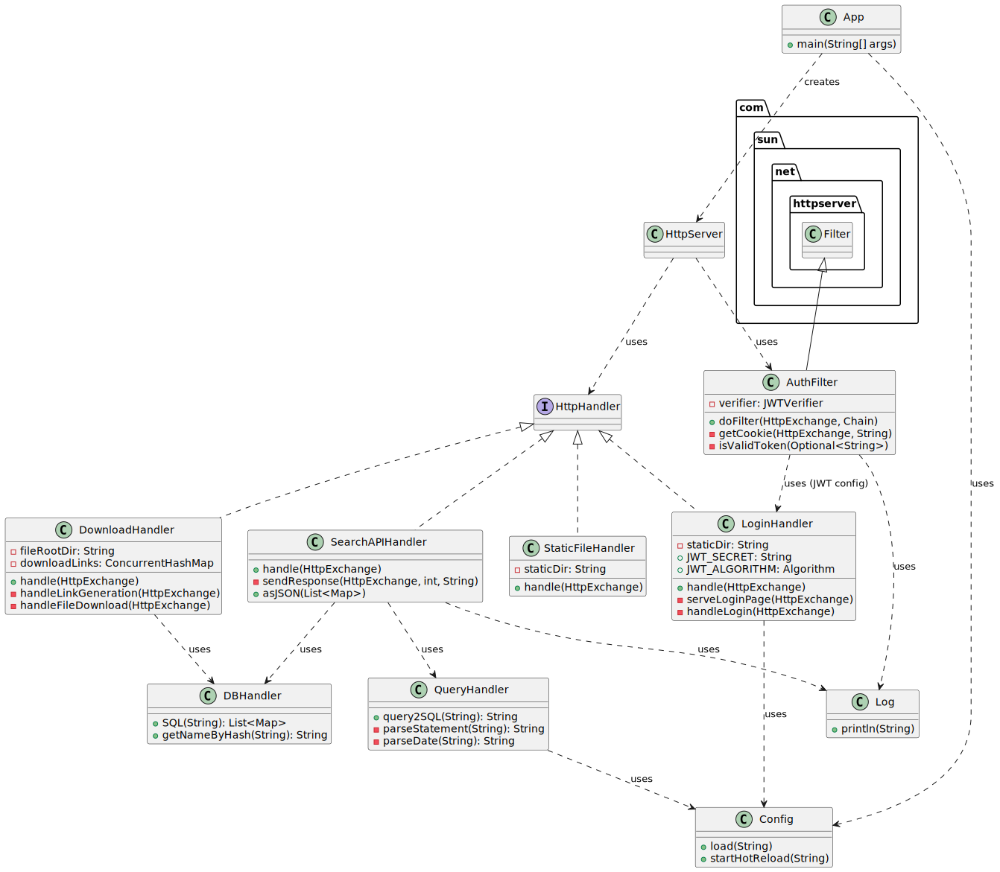

## 1、题目简述

本项目是一个轻量级的资料分享平台。其核心特点包括：
*   **无状态认证**：使用 JWT (JSON Web Token) 进行无状态会话管理，用户登录后获取一个有时效性（30分钟）的 Token，后续请求均通过此 Token 验证身份，有效杜绝未授权访问，且便于未来接入统一认证平台。
*   **高级搜索语法**：支持类似搜索引擎的复杂查询语法，用户可以精确控制搜索条件。以下按优先级从高到低的顺序介绍：
    *   `"text"`：引号表示精确匹配。
    *   `field:value`：冒号表示对指定字段进行检索（如 `filetype:pdf`）。
    *   `value1..value2`：两个点表示数值或日期的范围查询（包含起始值，不包含结束值），如 `filesize:1024..2048`。
    *   `AND`, `OR`, `NOT`：支持逻辑组合，其优先级为NOT>AND>OR。
    *   括号 `()` 用于控制逻辑优先级。
    *   一个更复杂的例子：`filetype:"pdf" OR filetype:docx world AND (filesize:0..2147483648) NOT hello OR time:000101..1231`
        *   这句查询的含义是：查找满足以下任一条件的文档：
            1.  文件类型**精确为** "pdf"；
            2.  或者，文件类型**包含** "docx"，文件名**包含** "world"，文件大小在 0 到 2147483648字节（2GB） 之间，且文件名**不包含** "hello"；
            3.  或者，文件的修改日期在2000年 1 月 1 日到今年 12 月 31 日之间。
*   **安全防盗链**：文件下载链接是临时的、一次性的，有效防止链接被盗用和滥用。支持单文件下载和多文件批量打包（ZIP）下载。

## 2、程序开发平台
*   **构建与运行**:
    *   使用 `mvn clean package` 命令进行构建。
    *   构建成功后，在 `target` 目录下会生成一个 `sharing_platform-0.1.jar` 文件。
    *   通过 `java -jar target/sharing_platform-0.1.jar` 命令即可启动服务。
*   **代码行数**：约 1000 行 (Java后端)
*   **开发环境**:
    *   **JDK**: `Java 21`
    *   **构建工具**: `Apache Maven 3.9+`
    *   **操作系统**: `Windows 11` / `Linux (KylinOS)` 
    *   **IDE**: `Visual Studio Code`

## 3、程序功能说明

**UML 用例图**




**功能文字说明**

1.  **登录系统 (UC_LOGIN)**:
    *   用户通过访问登录页面，输入预设的用户名和密码（本项目中硬编码为 `admin`/`admin`）进行认证。
    *   认证成功后，服务器会生成一个 JWT，并将其作为 `HttpOnly` 的 Cookie 返回给浏览器。此后，所有需要授权的请求都将自动携带此 Cookie。

2.  **搜索文件 (UC_SEARCH)**:
    *   已登录的用户可以访问主页，在搜索框中输入自定义的查询语句。
    *   系统后端将解析该查询语句，将其转换为 SQL `WHERE` 子句，并从 SQLite 数据库中检索匹配的文件信息。
    *   检索结果以列表形式动态展示在前端页面，包含文件名、大小、修改时间等元数据。

3.  **下载单个文件 (UC_DOWNLOAD_SINGLE)**:
    *   用户在搜索结果列表中点击单个文件的下载链接。
    *   前端向后端发起请求，后端生成一个临时的、一次性的下载 URL，并以重定向的方式让浏览器访问该 URL。
    *   浏览器访问临时 URL 后，服务器验证链接有效性，然后将文件流式传输给客户端，触发浏览器下载。

4.  **批量下载文件 (UC_DOWNLOAD_BULK)**:
    *   用户在搜索结果列表中勾选多个文件，然后点击“下载选中”按钮。
    *   与单文件下载类似，后端同样生成一个临时的、一次性的下载 URL。
    *   浏览器访问该 URL 后，服务器会在后端实时将多个文件打包成一个 ZIP 压缩包，并将其流式传输给客户端，实现批量下载。

## 4、程序算法说明及面向对象实现技术方案

#### （1）核心算法说明：自定义查询语言解析器

程序的核心算法位于 `QueryHandler` 类中，它实现了一个简单的递归下降解析器，用于将用户输入的自定义查询字符串转换为 SQL `WHERE` 子句。

*   **算法步骤**:
    1.  **词法分析 (Tokenization)**：`parseStatement` 方法首先遍历输入字符串，根据空格、括号、引号以及 `AND`, `OR`, `NOT`, `..`, `:` 等特殊符号，将字符串切分为一个 Token 列表（`StringList`）。例如，`filename:"test"` 会被切分为 `["filename", ":", "\"test\""]`。
    2.  **语法分析与归约 (Parsing & Reduction)**：
        *   **处理属性查询**：逆序遍历 Token 列表，当遇到 `:` 时，将其前后的 Token（属性名和值）合并为一个完整的 SQL 条件表达式。例如，`["filename", ":", "\"test\""]` 会被归约为 `["filename = \"test\""]`。此过程会根据属性名（如 `time`, `filesize`）对值进行特殊处理（如日期转换、数字验证）。
        *   **处理范围查询**：当遇到 `..` 时，将其与前后两个数值 Token 以及属性名合并为一个 SQL `BETWEEN` 或 `AND` 表达式。
        *   **处理括号**：通过递归调用 `parseStatement` 来处理括号内的子表达式，实现逻辑优先级的控制。
        *   **处理逻辑操作符**：处理 `NOT`，并为没有显式逻辑连接的相邻条件默认添加 `AND`。
    3.  **SQL 生成**：最后，将处理完成的 Token 列表用空格连接起来，形成最终的 SQL `WHERE` 子句。

*   **时间/空间复杂度**:
    *   该算法的时间复杂度大致为 O(N)，其中 N 是输入查询字符串的长度，因为整个过程主要是对字符串和 Token 列表的线性扫描。
    *   空间复杂度也为 O(N)，主要用于存储 Token 列表。

#### （2）面向对象实现

**UML 类图**




*   **类与关系**:
    *   **`App`**: 程序主入口，负责创建和配置 `HttpServer`，并将不同的 URL 上下文（Context）与对应的 `HttpHandler` 绑定。
    *   **`HttpHandler` 实现**: `StaticFileHandler`, `LoginHandler`, `SearchAPIHandler`, `DownloadHandler` 都实现了 `com.sun.net.httpserver.HttpHandler` 接口，分别负责处理静态文件、登录、搜索和下载的 HTTP 请求。
    *   **`AuthFilter`**: 继承自 `com.sun.net.httpserver.Filter`，作为一个认证过滤器，在请求到达 `SearchAPIHandler` 和 `DownloadHandler` 之前进行 JWT 验证。
    *   **工具类 (Utility Classes)**: `QueryHandler`, `DBHandler`, `Log` 是静态工具类，分别提供查询转换、数据库操作和日志记录的功能。它们被其他 Handler 按需调用。
    *   **关系**:
        *   `App` **组合**了所有 `HttpHandler` 和 `Filter`。
        *   `SearchAPIHandler` **依赖** `QueryHandler` 和 `DBHandler`。
        *   `DownloadHandler` **依赖** `DBHandler`。
        *   `AuthFilter` **依赖** `LoginHandler`（共享 JWT 密钥和算法）和 `Log`。

*   **包划分**:
    *   所有 Java 类都位于 `org.shareandimprove.cjj` 这一个包内，结构简单清晰。

*   **外部组件 (JARs)**:
    *   `sqlite-jdbc`: 用于连接和操作 SQLite 数据库。
    *   `gson`: Google 的 JSON 库，用于将数据库查询结果序列化为 JSON 字符串。
    *   `java-jwt`: 用于创建和验证 JWT。
    *   `slf4j-simple`: 一个简单的日志实现，用于满足 `java-jwt` 库的日志需求。
    *   `junit-jupiter`: 用于单元测试。

## 5、技术亮点、关键点及其解决方案

#### 本程序的亮点与技术关键点

1.  **轻量级与零依赖 Web 框架**：整个后端服务完全基于 Java 内置的 `com.sun.net.httpserver` 构建，没有引入任何 Spring, Jetty, Tomcat 等重型 Web 框架。这使得程序非常轻量，打包后是一个可直接运行的单一 JAR 文件，部署简单，资源占用极低。

2.  **自定义的高级查询解析器**：`QueryHandler` 是本项目的技术核心。它从零开始实现了一个小型领域特定语言（DSL）的解析器，能够将富有表现力的用户查询（如 `filetype:"pdf" AND (name:report OR name:doc)`）安全地转换为 SQL 查询，提供了远超简单关键字匹配的强大检索能力。

3.  **安全的无状态认证与防盗链机制**：
    *   通过 `HttpOnly` Cookie 存储 JWT，避免了 Token 被客户端脚本窃取的风险（XSS）。
    *   `DownloadHandler` 中实现的“临时链接”机制非常巧妙：它首先通过 POST 请求创建一个有时效性（5分钟）且存储在内存中的唯一ID，然后通过 302 重定向让浏览器 GET 这个ID。一旦ID被使用（或过期），它就会被立即从内存中移除，确保了每个下载链接只能被使用一次，有效实现了防盗链。

#### 遇到的技术难点及对应的解决方案

1.  **问题描述：如何安全地将用户输入转换为 SQL 查询？**
    *   **难点**：直接拼接用户输入到 SQL 语句中是 SQL 注入的重灾区。例如，恶意输入 `filename:"a"; DROP TABLE FILE; --"` 可能导致删库。虽然参数化查询是最佳实践，但题目要求尽可能不修改 `QueryHandler` 且不使用参数化查询。
    *   **解决方案**：在 `QueryHandler` 中设计了一套严格的白名单和语法规则。
        *   **属性名验证**：使用 `Validator.isValidAttr` 方法，确保所有用作列名的字符串（如 `filename`, `filetype`）都是合法的、非 SQL 关键字的标识符。
        *   **值处理**：对用户输入的值进行严格的上下文处理。字符串值被正确地用引号包裹，而数值和日期则会经过格式校验。
        *   **结构解析**：通过递归下降解析，确保 `AND`, `OR`, `()`, `..` 等结构符号只在预期的语法位置起作用，任何不符合语法的组合都会被拒绝并抛出异常。通过这种方式，虽然底层仍是字符串拼接，但构造出的 SQL 语句的结构是完全可控的，极大地降低了注入风险。

2.  **问题描述：如何实现可靠的浏览器文件下载，特别是通过 POST 请求触发？**
    *   **难点**：前端 JavaScript 的 `fetch` API 无法直接处理并触发由 302 重定向引导的文件下载，尤其当初始请求是 POST 时。浏览器出于安全考虑，不会自动将 POST 请求后重定向的响应作为文件下载。
    *   **解决方案**：在前端采用了一种“动态表单提交”的技巧。当用户点击下载时，JavaScript 并不直接 `fetch` 下载链接，而是：
        1.  向 `/api/download` 发起一个 POST 请求，这个请求的目的是在后端生成一个临时的下载ID。
        2.  后端响应一个 302 重定向到 `/download/<id>`。
        3.  前端的 `fetch` 设置了 `redirect: 'manual'`，它会捕获到这个 302 响应，但不会自动跟随。
        4.  此时，前端动态创建一个 `<form>` 元素，将其 `action` 设置为原始的 `/api/download`，`method` 设置为 `POST`，并将要下载的文件哈希作为表单数据。
        5.  通过 `form.submit()` 提交这个动态表单。浏览器原生处理表单提交，当它收到后端的 302 重定向响应时，会正确地发起一个新的 GET 请求到 `/download/<id>`，并处理后续的文件下载流程。

3.  **问题描述：多线程环境下日志记录和临时链接管理的线程安全问题。**
    *   **难点**：`SimpleDateFormat` 是非线程安全的，在多用户并发访问时，静态的 `Log` 类可能会产生日期格式化错误。同时，`DownloadHandler` 中的临时链接 `Map` 也需要被多个线程安全地读写和清理。
    *   **解决方案**：
        *   **日志**：在 `Log.println` 方法内部，每次调用都创建一个新的 `SimpleDateFormat` 实例，而不是使用一个静态共享的实例，从而避免了线程安全问题。
        *   **临时链接管理**：使用 `java.util.concurrent.ConcurrentHashMap` 来存储临时下载链接。这是一个线程安全的 `Map` 实现，保证了在高并发下 `put` 和 `remove` 操作的原子性和可见性。同时，使用 `ScheduledExecutorService` 在一个独立的后台守护线程中定期清理过期的链接，避免了在处理用户请求的线程中执行耗时的清理操作。

## 6、简要开发过程

#### 第一阶段：核心功能与基础架构搭建 (11月22日 - 11月26日)
*   **后端**：
    *   **查询解析器**：完成了 `QueryHandler` 的核心功能，实现了对自定义搜索语法的初步解析，支持了属性查询 (`:`), 精确匹配 (`""`), 逻辑组合 (`AND`, `OR`, `NOT`) 和优先级控制 (`()`)。
    *   **数据库交互**：实现了 `DBHandler`，用于执行由 `QueryHandler` 生成的 SQL 语句，并与 SQLite 数据库进行交互。
    *   **API 端点**：使用 Java 内置的 `HttpServer` 搭建了基础的 API 端点，包括用于静态文件服务的根路径 `/`、用于搜索的 `/api/search` 和一个初步的单文件下载接口。
*   **前端**：
    *   开发了主页面 `index.html`，包含一个搜索表单和用于展示搜索结果的区域。

#### 第二阶段：功能扩展与增强 (11月27日 - 12月3日)
*   **后端**：
    *   **批量下载**：初步实现了批量下载功能，增加了一个专用的 `/bulk` 接口来处理多个文件的下载请求 (此接口在后续阶段被重构)。
    *   **查询功能增强**：对 `QueryHandler` 进行了扩展，增加了对数值范围查询 (`..`) 和日期格式查询的支持，使其能够处理如 `filesize:1024..2048` 和 `time:20240101` 这样的高级查询。

#### 第三阶段：安全强化与架构重构 (12月4日 - 12月7日)
*   **后端**：
    *   **下载机制重构**：
        *   统一了单文件和批量下载的逻辑，移除了原有的 `/bulk` 接口。
        *   引入了**一次性安全下载链接**机制：客户端首先向 `/api/download` 发起 POST 请求，服务器生成一个唯一的、有5分钟时效的下载ID，并以 302 重定向的方式返回给客户端。客户端再通过 GET 请求访问该临时链接完成下载。
        *   在 `DownloadHandler` 中引入 `ScheduledExecutorService`，创建了一个后台守护线程，用于定期清理过期的下载链接，防止内存泄漏。
    *   **认证系统集成**：
        *   实现了 `LoginHandler` 和 `AuthFilter`，引入了基于 JWT 的无状态认证系统。
        *   用户登录成功后，服务器会颁发一个有效期为30分钟的 `HttpOnly` Cookie，所有受保护的 API 请求都必须通过 `AuthFilter` 的验证。
    *   **问题修复**：解决了下载包含中文等非 ASCII 字符的文件名时出现的乱码问题，通过在 `Content-Disposition` 响应头中正确使用 RFC 5987 标准进行编码。

## 7、个人小结及建议

小结：

1.  **网络编程与HTTP协议**: 通过使用Java内置的`HttpServer`从零开始构建Web服务，我不再将Web后端视为一个黑盒。我深入学习了如何处理HTTP请求（GET/POST）、解析URI和请求体、设置响应头（如`Content-Type`, `Location`, `Set-Cookie`）以及发送不同状态码（200, 302, 401等）。这种底层的编程方式让我对HTTP协议的工作流程有了更直观的认识。
2.  **网络认证与安全**: 项目中实现的JWT无状态认证机制让我掌握了现代Web应用中身份验证的核心思想。我学会了如何生成、分发和验证Token，并理解了将JWT存储在`HttpOnly` Cookie中以防范XSS攻击的重要性。此外，设计的“一次性下载链接”方案，通过后端生成临时ID并结合定时清理任务，让我实践了如何设计一个简单而有效的防盗链机制，加深了对Web安全的理解。
3.  **递归下降解析算法**: `QueryHandler`的设计与实现是我在算法应用方面最大的收获。我从零开始设计并实现了一个用于解析自定义搜索语法的递归下降解析器。这个过程涵盖了词法分析（将字符串切分为Token）和语法分析（根据`:`、`()`、`AND/OR/NOT`等规则递归地构建查询逻辑）。它不仅锻炼了我的算法设计能力，也让我体会到编译原理中的经典思想在实际项目中的强大应用价值。

建议：建议Java课程可以面向实际业务场景，适当增加讲授网络请求等功能的实现方式。

---

### 附录：程序使用方法

#### 1. 环境要求
*   **Java**: JDK 21 或更高版本。JDK 11和JDK 17运行时仅能查询，下载功能不能实现。 
*   **Maven**: 3.6.3 或更高版本。

#### 2. 编译与运行
1.  **编译**: 在项目根目录下（`pom.xml`所在目录），执行以下命令进行编译和打包：
    ```bash
    mvn clean package
    ```
    命令成功后，会在 `target/` 目录下生成 `sharing_platform-0.1.jar` 文件。

2.  **运行**: 确保 `files`, `db`, `static` 等目录与 `target` 目录处于同一项目根目录下。然后执行以下命令启动服务：
    ```bash
    java -jar target/sharing_platform-0.1.jar
    ```
    服务启动后，会监听 `8080` 端口。所有运行日志会同时输出到控制台和 `log/runtime.log` 文件中。

#### 3. 文件与数据库管理 (通过Python脚本)
本项目Java部分暂不包含文件入库逻辑，需要通过提供的Python脚本进行管理。
*   **添加文件**: 将需要分享的文件放入 `raw_files` 文件夹，然后运行 `UpdateDB.py` 脚本。脚本会自动计算文件哈希值，将其重命名并移动到 `files` 目录，同时将文件元数据写入 `db/platform.db` 数据库。
*   **重置数据库**: 运行 `InitDB.py` 脚本并确认，可以清空数据库，并将 `files` 目录下的所有文件恢复其原始名称并移回 `raw_files` 目录。

---

### To-Do List

*   **日志管理**: 实现日志文件的自动轮转（按日期或大小分割）与定期清理，防止日志文件无限增长。
*   **文件上传**: 在Web界面增加文件上传功能，允许用户直接通过浏览器上传文件，并自动完成文件哈希、重命名和入库流程。
*   **全文内容检索**: 集成OCR或文本提取工具（如Tika），将文件内容提取为文本并存入数据库，以支持基于文件内容的全文搜索。
*   **数据关联**: 建立新的数据表（如课程信息表），并将文件资料与课程进行关联，实现按课程筛选资料的功能。
*   **统一认证集成**: 将现有JWT认证系统与BIT101对接，实现单点登录。

（本文档由作者和Gemini 2.5 Pro共同撰写）